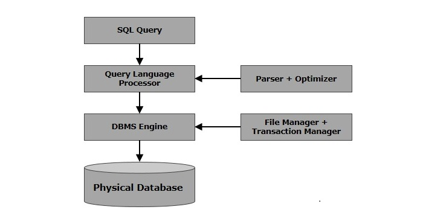

# SQL & RDBMS

SQL is the standard language for any Relational Database System. All the Relational Data Base Management Systems (RDBMS) like MySQL, MS Access, Oracle, Sybase, Informix, Postgres and SQL Server use SQL as their standard database language. SQL is used to store and retrieve the data from a database. 

## SQL Basic Commands 

| Type | Description | Commands |
|------|-------------|----------|
| Data Definition Language (DDL) | Used to create and modify the structure of database objects(tables, views, schemas, and indexes etc) | CREATE, ALTER, DROP, TRUNCATE |
| Data Manipulation Language (DML) | Used for adding, deleting, and modifying data in a database | SELECT, INSERT, UPDATE, DELETE |
| Data Control Language (DCL) | Used to control access to data stored in a database | GRANT, REVOKE |

## How SQL works?

In SQL architecture, when you execute an SQL command on any Relational Database Management System (RDBMS), several components work together to process the request efficiently. 

Here's a breakdown of the key components :

| Component | Description |
|-----------|-------------|
| Query Dispatcher | The Query Dispatcher routes the SQL query to the appropriate query processor or engine. It determines which part of the system is responsible for handling the specific query. |
| Optimization Engines | The Optimization Engine is responsible for improving the performance of the query by evaluating different execution plans and selecting the most efficient one. It tries to reduce the time and resources required to run the query. |
| Classic Query Engine | This engine is responsible for handling non-SQL queries, such as those used in legacy systems or file-based queries. It focuses on older query types that are not structured as SQL. |
| SQL Query Engine | The SQL Query Engine is the core part of the system that processes SQL-specific commands. It handles tasks such as SELECT, INSERT, UPDATE, and DELETE, and ensures the SQL query interacts with the database as expected. |

### Overall Process Flow
- **Parsing :** The SQL query is first parsed to check its syntax and semantics.
- **Optimization :** The Optimization Engine evaluates multiple ways to execute the query and chooses the most efficient one.
- **Execution :** The chosen query plan is executed, and the requested data is retrieved, updated, or deleted.

Following is a simple diagram showing the SQL Architecture

To learn more about how SQL Request-Response cycle works, [click here](./Notes/how_sql_works.md).

## RDBMS Concepts
A Relational database management system (RDBMS) is a database management system (DBMS) that is based on the relational model as introduced by E. F. Codd in 1970.

### Some important terminologies of DBMS

| **Item Name** |**Description**|
|---------------|---------------|
| **Table**     | A collection of related data organized in rows and columns, representing a specific entity in the database. |
| **Row**       | A single entry or record in a table, representing one instance of the entity described by the table.       |
| **Column**    | A specific attribute of an entity in the table, with a unique name and data type.                          |
| **Field**     | The value at the intersection of a row and a column, containing specific data for that attribute.          |

### Example
Suppose a table `customers` is given below :

| ID | Name | Email | Phone |
|------------|------|-------|-------|
| 101 | John Doe   | john.doe@example.com | 123-456-7890 |
| 102 | Jane Smith | jane.smith@example.com | 987-654-3210 |
| 103 | Alice Lee  | alice.lee@example.com | 555-555-5555 |

Here 
- `customers` is a table.
- A single customer entry, such as `{ ID: 101, Name: John Doe, Email: john.doe@example.com, and Phone: 123-456-7890 }` is a record or row.
- The `Name` is a column that lists the names of customers.
- The value `John Doe` is the field in the Name column for the customer with ID: 101.

## Null vs Zero in a table's record
| **Aspect** | **NULL Value** | **Zero Value** |
|------------|----------------|----------------|
| **Meaning** | Represents the **absence of a value**. | Represents a numerical value of **0**. |
| **Data Type** | Can appear in any data type (e.g., strings, numbers, dates, etc.). | Only applicable to numerical fields (e.g., integers, floats). |
| **Implication** | Indicates that no data was provided. | Indicates a value of zero was explicitly assigned or calculated. |
| **Storage** | Takes up special storage space to represent "no value." | Stored as a numerical 0.|
| **Usage** | Used when you don’t know the value or it's irrelevant. | Used when the value is explicitly zero (e.g., quantity = 0). |

## SQL Constraints
Constraints are the rules enforced on data columns of a table. This ensures the accuracy and reliability of the data in the database.

Constraints can either be column level or table level. 
- Column level constraints are applied only to one column.
- Table level constraints are applied to the entire table.

Following are some of the most commonly used constraints available in SQL −

| SI. No. | Constatints | Description |
|---------|-------------|-------------|
| 1 | NOT NULL | Ensures that a column cannot have a NULL value. |
| 2 | DEFAULT | Provides a default value for a column when none is specified. |
| 3	| UNIQUE Key | Ensures that all the values in a column are different. |
| 4 | PRIMARY Key | Uniquely identifies each row/record in a database table. |
| 5 | FOREIGN Key | Uniquely identifies a row/record in any another database table. |
| 6 | CHECK | Ensures that all values in a column satisfy certain conditions. |
| 7	| INDEX | Used to create and retrieve data from the database very quickly. |

## Data type in SQL

- String 
- Numeric
- Date and Time

### Most frequently used data-type in MySQL

| Data Type | Description | Example |
|-----------|-------------|---------|
| INT | Used for storing integer values (whole numbers). | 12345 |
| BIGINT | Stores large integer values (8 bytes). | 9223372036854775807 |
| TINYINT | A very small integer (1 byte). | 127 |
| BOOLEAN | Alias for TINYINT(1), represents true (1) or false (0). | 1 (true) or 0 (false) |
| FLOAT | Used for storing approximate floating point numbers. | 123.45 |
| DOUBLE | Stores double-precision floating point numbers. | 12345.6789 |
| DECIMAL | Stores exact numeric data with decimal places. | 12345.67 |
| CHAR | **Fixed-length string**, padded with spaces if shorter. | `'A'` or `'XYZ    '` |
| VARCHAR | **Variable-length string**, commonly used for text with a max length. | 'Hello World' |
| TEXT | For storing long text data. | 'This is a long text block...' |
| DATE | Stores dates in 'YYYY-MM-DD' format. | '2024-09-18' |
| DATETIME | Stores date and time in 'YYYY-MM-DD HH:MM:SS' format. | '2024-09-18 14:30:00' |
| TIME | Stores time values in 'HH:MM:SS' format. | '14:30:00' |
| TIMESTAMP | Stores both date and time in a format similar to DATETIME. | '2024-09-18 14:30:00' |
| BLOB | Used to store binary large objects like images or files. | Binary data (e.g., image file) |
| ENUM | A string object with a predefined set of values. | 'small', 'medium', 'large' |

See data-type of different database systems from [here](https://www.tutorialspoint.com/sql/sql-data-types.htm).  

## References
- [Tutorials point](https://www.tutorialspoint.com/sql/index.htm)