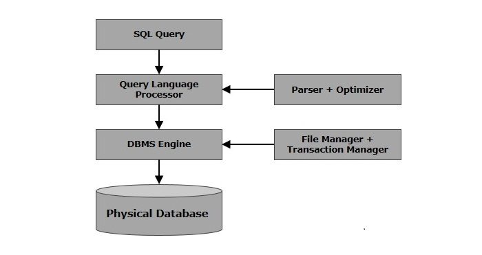

# Standard Query Language (SQL)

SQL is the standard language for any Relational Database System. All the Relational Data Base Management Systems (RDBMS) like MySQL, MS Access, Oracle, Sybase, Informix, Postgres and SQL Server use SQL as their standard database language. SQL is used to store and retrieve the data from a database. 

### SQL Basic Commands 

| Type | Description | Commands |
|------|-------------|----------|
| Data Definition Language (DDL) | Used to create and modify the structure of database objects(tables, views, schemas, and indexes etc) | CREATE, ALTER, DROP, TRUNCATE |
| Data Manipulation Language (DML) | Used for adding, deleting, and modifying data in a database | SELECT, INSERT, UPDATE, DELETE |
| Data Control Language (DCL) | Used to control access to data stored in a database | GRANT, REVOKE |

### How SQL works?

When we are executing an SQL command for any RDBMS, the system determines the best way to carry out our request and **SQL engine** figures out how to interpret the task. 

There are various components included in this process. These components are −
- Query Dispatcher
- Optimization Engines
- Classic Query Engine
- SQL Query Engine, etc.

A classic query engine handles all the non-SQL queries, but a SQL query engine won't handle logical files. Following is a simple diagram showing the SQL Architecture −

## References
- [Tutorials point](https://www.tutorialspoint.com/sql/index.htm)